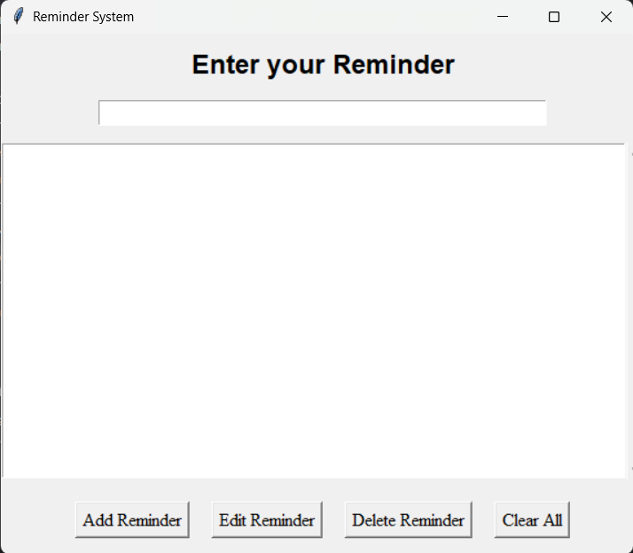

---


**Reminder System**

A simple Tkinter-based desktop application to manage your daily reminders. This application supports adding, editing, deleting, and clearing reminders with automatic indexing and persistence using JSON storage.

---


**Features**

* 📌 Add new reminders with a single click or Enter key.
* ✏️ Edit existing reminders and retain their original position.
* ❌ Delete selected reminders.
* 🔄 Clear all reminders from the list.
* 📜 Scrollable list for easy navigation.
* 💾 Reminders are saved locally and reloaded on the next startup.

---


**Technologies Used**

# **Language:** Python 3.x
# **GUI Library:** Tkinter
# **Storage:** JSON
# **Dependencies:**

  * `tkinter` - For GUI
  * `json` - For storing reminders
  * `os` - For file path handling

---


**Project Structure**

```
reminder_system/
│
├── reminders.json            # JSON file to store reminders
├── reminder_system.py        # Main application file
├── README.md                 # Project documentation
└── assets/                   # Optional: store icons or images for UI
```

---


**Setup Instructions**

1. Clone the repository:

   ```bash
   git clone https://github.com/yourusername/reminder_system.git
   cd reminder_system
   ```

2. Create a virtual environment (optional but recommended):

   ```bash
   python -m venv venv
   source venv/bin/activate    # On Linux/macOS
   .\venv\Scripts\activate     # On Windows
   ```

3. Run the application:

   ```bash
   python reminder_system.py
   ```

---


**Usage**

1. **Add Reminder:** Type your reminder and click "Add Reminder" or press `Enter`.
2. **Edit Reminder:** Select a reminder from the list, click "Edit Reminder," update the text, and press "Add Reminder."
3. **Delete Reminder:** Select a reminder and click "Delete Reminder."
4. **Clear All Reminders:** Click "Clear" to remove all items from the list.
5. **Scroll:** Use the scrollbar to navigate through long lists.

---


**Preview**

 *(Add a screenshot of your application UI here)*

---


**Planned Enhancements**

* 🔔 **Pop-up Reminder Notifications**
* 📆 **Date and Time Scheduler**
* 📌 **Pin Important Reminders**
* 🌐 **Cloud Sync for Multi-Device Support**

---


**Contributing**

Feel free to fork this repository, submit issues, and create pull requests. Contributions are welcome!

---


**License**

This project is licensed under the MIT License - see the [LICENSE](LICENSE) file for details.

---


**Contact**

For any queries or issues, feel free to reach out:

* **Email:** [savdekaryash18@gmail.com](mailto:savdekaryashu18@gmail.com)
* **GitHub:** [Savdekaryashu](https://github.com/Savdekaryashu)

